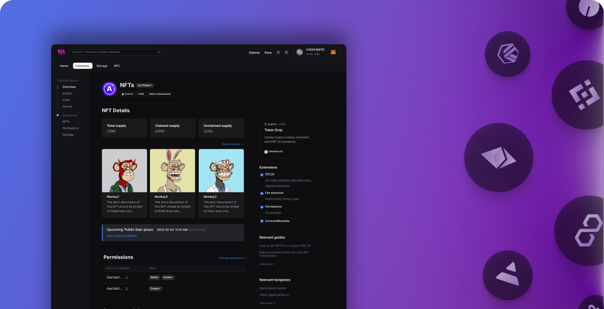

# 🚀 EtherFund - Decentralized Crowdfunding Platform

A modern Web3 crowdfunding application built with React, TypeScript, and Solidity that enables users to create and fund campaigns using Ethereum blockchain technology.



## ✨ Features

- 🎯 **Create Campaigns** - Start fundraising campaigns with goals, deadlines, and descriptions
- 💰 **Donate to Campaigns** - Support projects with ETH donations
- 📊 **Real-time Tracking** - Live progress bars and donation statistics
- 🔍 **Campaign Discovery** - Browse and discover active campaigns
- 👤 **User Profiles** - Track your campaign history and contributions
- 📱 **Responsive Design** - Works seamlessly on desktop and mobile
- 🔒 **Secure & Decentralized** - Built on Ethereum blockchain with smart contracts

## 🏗️ Tech Stack

### Frontend
- **React 18** with **TypeScript**
- **Vite** - Fast build tool and dev server
- **TailwindCSS** - Utility-first CSS framework
- **React Router** - Client-side routing
- **Thirdweb SDK** - Web3 integration
- **Ethers.js** - Ethereum utilities

### Backend
- **Solidity** - Smart contract development
- **Hardhat** - Development framework
- **Thirdweb** - Contract deployment and management
- **zkSync** - Layer 2 scaling solution

## 🚀 Quick Start

### Prerequisites
- Node.js 22.x or higher
- Git
- MetaMask wallet
- Goerli testnet ETH (for testing)

### Installation

1. **Clone the repository**
   ```bash
   git clone https://github.com/yourusername/etherfund-project.git
   cd etherfund-project
   ```

2. **Install dependencies**
   ```bash
   # Install client dependencies
   cd client
   npm install

   # Install smart contract dependencies
   cd ../web3
   npm install
   ```

3. **Set up environment variables**
   ```bash
   # In client directory
   cp .env.example .env.local
   ```

   Add your environment variables:
   ```env
   VITE_THIRDWEB_CLIENT_ID=your_client_id
   VITE_CONTRACT_ADDRESS=your_contract_address
   ```

4. **Deploy smart contracts**
   ```bash
   cd web3
   npm run deploy
   ```

5. **Start the development server**
   ```bash
   cd client
   npm run dev
   ```

6. **Open your browser**
   Navigate to `http://localhost:5173`

## 📁 Project Structure

```
etherfund-project/
├── client/                 # Frontend React application
│   ├── src/
│   │   ├── components/    # Reusable UI components
│   │   ├── pages/         # Page components
│   │   ├── context/       # React context for state management
│   │   ├── assets/        # Images and icons
│   │   ├── utils/         # Utility functions
│   │   └── constants/     # App constants
│   ├── public/            # Static assets
│   └── package.json
├── web3/                  # Smart contracts
│   ├── contracts/         # Solidity contracts
│   └── package.json
└── README.md
```

## 🔧 Available Scripts

### Client (Frontend)
```bash
npm run dev          # Start development server
npm run build        # Build for production
npm run preview      # Preview production build
npm run deploy       # Deploy to IPFS via Thirdweb
```

### Web3 (Smart Contracts)
```bash
npm run build        # Compile contracts
npm run deploy       # Deploy contracts
npm run release      # Release contracts publicly
```

## 🎨 UI Components

- **FundCard** - Campaign display cards
- **DisplayCampaigns** - Campaign grid layout
- **FormField** - Reusable form inputs
- **CustomButton** - Styled action buttons
- **CountBox** - Statistics display
- **Loader** - Loading states
- **Navbar** - Navigation header
- **Sidebar** - Navigation sidebar

## 🔗 Smart Contract

The `CrowdFunding.sol` contract includes:

- **Campaign Creation** - Create new fundraising campaigns
- **Donation System** - Accept ETH donations
- **Campaign Retrieval** - Get all campaigns and details
- **Donor Tracking** - Track contributors and amounts

### Contract Functions
```solidity
createCampaign()     // Create a new campaign
donateToCampaign()   // Donate to a campaign
getCampaigns()       // Get all campaigns
getDonators()        // Get campaign donors
```

## 🌐 Deployment

### Frontend (Vercel)
1. Connect your GitHub repository to Vercel
2. Set Node.js version to 22.x in project settings
3. Deploy automatically on push to main branch

### Smart Contracts (Thirdweb)
```bash
cd web3
npm run deploy
```

### IPFS Deployment
```bash
cd client
npm run deploy
```

## 🔐 Security Features

- **Smart Contract Security** - Audited Solidity contracts
- **Wallet Integration** - Secure MetaMask connection
- **Input Validation** - Client and contract-side validation
- **Image Verification** - URL validation for campaign images

## 🎯 Usage Guide

### Creating a Campaign
1. Connect your MetaMask wallet
2. Navigate to "Create Campaign"
3. Fill in campaign details (title, description, goal, deadline, image)
4. Submit the campaign
5. Share your campaign link

### Donating to Campaigns
1. Browse available campaigns
2. Click on a campaign to view details
3. Enter donation amount in ETH
4. Confirm transaction in MetaMask
5. Track your donation in the campaign

## 🤝 Contributing

1. Fork the repository
2. Create a feature branch (`git checkout -b feature/amazing-feature`)
3. Commit your changes (`git commit -m 'Add amazing feature'`)
4. Push to the branch (`git push origin feature/amazing-feature`)
5. Open a Pull Request

## 📝 License

This project is licensed under the MIT License - see the [LICENSE](client/LICENSE.md) file for details.

## 🙏 Acknowledgments

- [Thirdweb](https://thirdweb.com/) - Web3 development platform
- [Vite](https://vitejs.dev/) - Build tool
- [TailwindCSS](https://tailwindcss.com/) - CSS framework
- [Ethers.js](https://docs.ethers.io/) - Ethereum library

## 📞 Support

- **Discord**: [Thirdweb Discord](https://discord.gg/thirdweb)
- **Documentation**: [Thirdweb Docs](https://docs.thirdweb.com/)
- **Issues**: [GitHub Issues](https://github.com/yourusername/etherfund-project/issues)

## 🔮 Roadmap

- [ ] Multi-token support (ERC-20 tokens)
- [ ] Campaign categories and filtering
- [ ] Social sharing features
- [ ] Campaign analytics dashboard
- [ ] Mobile app development
- [ ] Integration with more Layer 2 solutions

---

**Built with ❤️ using React, TypeScript, and Web3 technologies**
